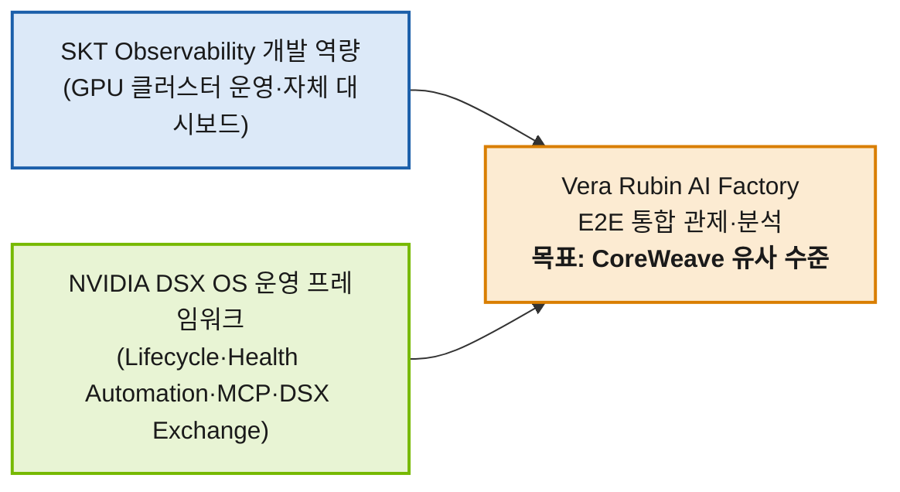
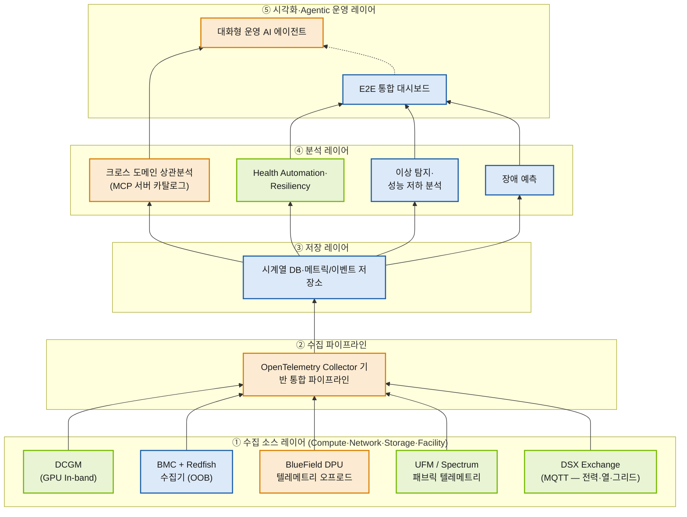
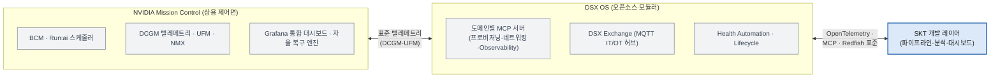
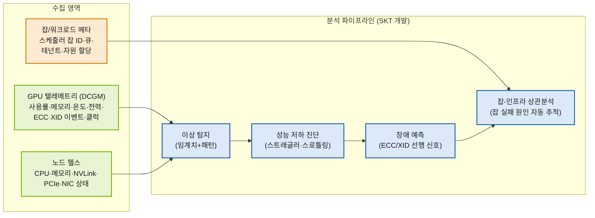
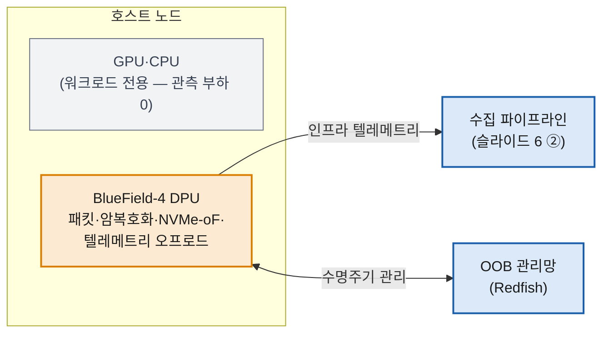

# 02. 정보 설계 가이드 — NVIDIA DSX OS 기반 E2E Observability 개발 논의

> Presentation Architect 산출물. `01_story_structure.md`(승인본, 13장)의 슬라이드 구성을 준수한다.
> 사용자 확정 사항 반영: (1) 목적 = DSX OS 기반 Compute·Network·Storage 포함 E2E DC Observability 확보,
> (2) 개발 목표 = **CoreWeave와 유사 수준의 모니터링/분석 환경** → 슬라이드 5 벤치마크 비교, 슬라이드 12 로드맵 도달점에 명시.
>
> 수치 원칙: 출처(00b 리서치 노트) 있는 수치만 사용. SKT 내부 수치는 전부 `[플레이스홀더: SKT 제공 필요]`.

---

## 1. 데이터 시각화 맵 (전체 개요)

| 슬라이드 | 정보 유형 | 시각화 유형 | 핵심 인사이트 (1장 1메시지) | 데이터 소스 |
|---|---|---|---|---|
| 2 | 개념(결합)+결정 | 2단 결합 다이어그램 + 결정 카드 3개 | SKT 역량 × DSX OS = E2E 관제, 오늘 3가지 결정 | 스토리보드 D1~D3 |
| 3 | 시간(이력) | 타임라인 + 스크린샷 플레이스홀더 | SKT는 이미 해봤다 (자격 입증) | [플레이스홀더: SKT 제공 필요] |
| 4 | 범주(기능) | 스크린샷 그리드 + 기능 태그 테이블 | 수집–분석–시각화–알림 전 기능 서비스 중 | [플레이스홀더: SKT 제공 필요] |
| 5 | 대비(As-Is/To-Be)+벤치마크 | 전환 테이블 + CoreWeave 4축 벤치마크 테이블 | 현행 체계로는 불가 + 업계 표준은 이미 저만치 | 리서치 노트(CoreWeave) |
| 6 | 구조(아키텍처) | 풀페이지 레이어드 다이어그램 (Mermaid) | 5레이어 E2E 구조, DSX OS 골격 + SKT 개발 레이어 | 리서치 노트(DSX OS) |
| 7 | 비교 매트릭스(RACI형) | 도메인×기능 범위 매트릭스 (3색) | 경계 확정이 오늘의 첫 번째 결정 (D2) | 6번 아키텍처에서 도출 |
| 8 | 구조(참고) | 간략 참조 아키텍처 (회색 톤) | 오픈·표준 인터페이스 → 락인 리스크 낮음 | 리서치 노트(Mission Control) |
| 9 | 프로세스(파이프라인) | 수집 영역 맵 + 분석 파이프라인 플로 | DCGM 수집 → 장애 예측·잡 상관까지 확장 | 리서치 노트(DCGM) |
| 10 | 비교(3열) | 3열 비교 테이블 + DPU 오프로드 개념도 | 하이브리드 수집 전략 (D3 전반부) | 리서치 노트(In-band/OOB/DPU) |
| 11 | 범주+단계 | 3분할 도메인 카드 + Phase 배지 | 기존 소스 연동으로 단계적 통합 (D3 후반부) | 리서치 노트(UFM/STX/Exchange) |
| 12 | 결정+시간(로드맵) | 결정 체크카드 3개 + 간이 로드맵 타임라인 | 확정 시 즉시 착수, 도달점 = CoreWeave 동등 수준 | D1~D3 + 일정 플레이스홀더 |

슬라이드 1(표지)·13(Discussion)은 텍스트 레이아웃 중심으로 시각 자료 명세 대상에서 제외 (visual-designer가 레이아웃만 처리).

---

## 2. 색상 코딩 규칙 (전 슬라이드 공통)

슬라이드 6·7의 "제공 주체 3색"을 덱 전체의 기본 시맨틱 컬러로 고정한다. **같은 의미 = 같은 색**을 2~12번 전 슬라이드에서 유지할 것.

| 의미 | 라벨 | 본색 (선/텍스트) | 틴트 (박스 배경) | 사용처 |
|---|---|---|---|---|
| **DSX OS 기본 제공** | `DSX` | `#76B900` (그린) | `#E8F4D4` | 슬라이드 2·5·6·7·8·10·11 (NVIDIA 연상 그린, 로고·브랜드 자산은 미사용) |
| **SKT 개발** | `SKT` | `#1B5FAA` (블루) | `#DCE9F8` | 슬라이드 2·3·4·6·7·9·10·11 |
| **공동 개발** | `공동` | `#D97E00` (앰버) | `#FCEBD2` | 슬라이드 6·7·9·11·12 |
| 중립/참고 | — | `#6B7280` (그레이) | `#F1F3F5` | 슬라이드 8 전체 톤, 각주·출처 |
| 갭/경고 (As-Is 문제) | — | `#C0392B` (레드, 절제 사용) | `#FBE9E7` | 슬라이드 5 As-Is 열, 벤치마크 ✕ 표시 |
| 강조/결정 | — | `#0F2A4A` (다크 네이비) 배경 + 백색 텍스트 | — | 슬라이드 2·12 결정 카드 (수미상관 모티프) |

- 접근성: 3색 구분은 색상 + **라벨 텍스트(DSX/SKT/공동)** 병기 필수 (색각이상 대응, 색상만으로 구분 금지).
- 적-녹 조합 회피: 레드(#C0392B)와 그린(#76B900)을 같은 차트/테이블 인접 셀에 두지 않는다. 벤치마크 테이블에서는 ●/△/✕ 기호를 병기.
- Mermaid 공통 classDef (모든 다이어그램 상단에 포함):

```
classDef dsx fill:#E8F4D4,stroke:#76B900,stroke-width:2px,color:#1A1A1A;
classDef skt fill:#DCE9F8,stroke:#1B5FAA,stroke-width:2px,color:#1A1A1A;
classDef joint fill:#FCEBD2,stroke:#D97E00,stroke-width:2px,color:#1A1A1A;
classDef ref fill:#F1F3F5,stroke:#6B7280,stroke-width:1px,color:#374151;
```

---

## 3. 슬라이드별 정보 설계

### 슬라이드 2: 협력 목표와 오늘의 결정 사항

- **정보 유형**: 개념(결합 구도) + 결정 프리뷰
- **시각화 방식**: 좌우 2단 결합 다이어그램(상단 60%) + 결정 카드 3개(하단 40%)
- **정보 계층**
  - 핵심(3초): "SKT 역량 + DSX OS = Vera Rubin AI Factory E2E 관제" 결합 구도와 **결정 카드 3개의 존재**
  - 부가: 각 결정 카드의 한 줄 내용(D1·D2·D3), 목표 문구 "CoreWeave 유사 수준의 모니터링/분석 환경 확보"
  - 참고: 필요 산출물(아키텍처 설계서, 범위 정의서, PoC 계획) 풋노트
- **수치 스토리텔링**: 수치 없음 — 대신 목표 문구에 "CoreWeave 유사 수준"을 명시해 슬라이드 5·12와 수미상관 연결
- **Mermaid 코드** (결합 다이어그램):



- **결정 카드 3개** (다크 네이비 #0F2A4A 배경, 체크박스 모티프 — 슬라이드 12와 동일 비주얼):
  - ☐ **D1. 아키텍처 방향** — DSX OS 골격 E2E 레이어드 구조 채택
  - ☐ **D2. 개발·연동 범위** — DSX OS 제공 / SKT 개발 / 공동 개발 경계 확정
  - ☐ **D3. 수집 전략·단계화** — In-band+OOB+DPU 하이브리드, 도메인 Phase 순서

---

### 슬라이드 3: SKT Observability 개발 경험

- **정보 유형**: 시간(이력) + 실물 증거
- **시각화 방식**: 상단 수평 타임라인 + 하단 좌측 실적 요약 카드, 하단 우측 대시보드 스크린샷 플레이스홀더 1매
- **정보 계층**
  - 핵심(3초): "해외(해인) GPU 클러스터에서 Observability를 **직접 개발·운영해 왔다**"는 타임라인의 존재
  - 부가: 축적 역량 키워드 4개 (메트릭 수집 파이프라인 / GPU 헬스 관리 / 통합 대시보드 / 알림·이상 탐지)
  - 참고: 클러스터 규모·기간 세부 수치
- **수치 스토리텔링**: 내부 수치 전부 플레이스홀더 — 임의 생성 금지
  - 클러스터 규모(GPU 수/노드 수): `[플레이스홀더: SKT 제공 필요]`
  - 운영 기간·수집 메트릭 종수·일 수집량: `[플레이스홀더: SKT 제공 필요]`
- **타임라인 구조 기술** (Mermaid timeline 또는 수평 화살표 밴드, SKT 블루 #1B5FAA 단색):
  - 노드 1: `[YYYY 플레이스홀더]` GPU 클러스터(해외·해인) 운영 개시
  - 노드 2: `[YYYY 플레이스홀더]` Observability 솔루션 자체 개발 착수
  - 노드 3: `[YYYY 플레이스홀더]` 통합 대시보드 서비스 개시
  - 노드 4: **2026 (현재)** AI Factory 대응 고도화 논의 ← 이 노드만 앰버(#D97E00)로 강조해 슬라이드 5로 브릿지
- **스크린샷 플레이스홀더**: 16:9 프레임, 라벨 "대표 대시보드 화면 — SKT 제공 예정", 회색 대각선 패턴 배경

---

### 슬라이드 4: SKT Observability 주요 기능

- **정보 유형**: 범주(기능 분류) + 실물 증거
- **시각화 방식**: 스크린샷 플레이스홀더 2~3매 그리드(좌측 65%) + 기능 카테고리 태그 테이블(우측 35%)
- **정보 계층**
  - 핵심(3초): 대시보드 실물(플레이스홀더) — "이미 서비스 중"이라는 시각적 인상
  - 부가: 기능 카테고리 4~5개 태그
  - 참고: MRM·Facility-aware 상세는 백업 장표 이동 표기 ("→ 백업 슬라이드 A 참조")
- **기능 카테고리 테이블** (실제 셀 내용):

| 기능 카테고리 | 세부 기능 | 상태 |
|---|---|---|
| 메트릭 수집 | GPU·노드 메트릭 파이프라인 (DCGM 기반) | 운영 중 `[확인: SKT]` |
| GPU 헬스 | 온도·ECC·XID 이벤트 추적, 헬스 스코어 | 운영 중 `[확인: SKT]` |
| 시각화 | 클러스터/노드/잡 단위 통합 대시보드 | 운영 중 `[확인: SKT]` |
| 알림·이상 탐지 | 임계치·패턴 기반 알림 | 운영 중 `[확인: SKT]` |
| MRM / Facility-aware | 상세는 백업 장표 | 백업 참조 |

- **스크린샷 플레이스홀더**: 각 프레임에 캡션 자리 포함 — "① 클러스터 개요", "② GPU 헬스", "③ 알림 콘솔" (실제 화면명은 SKT 확인 후 교체)
- **수치 스토리텔링**: 기능별 정량 지표(알림 건수, 탐지 정확도 등) `[플레이스홀더: SKT 제공 필요]` — 있으면 태그 옆 작은 숫자로 배치

---

### 슬라이드 5: AI Factory 전환 — 왜 지금 고도화가 필요한가

- **정보 유형**: 대비(As-Is/To-Be) + 경쟁 벤치마크 (사용자 확정: CoreWeave = 명시적 벤치마크 타깃)
- **시각화 방식**: 상단 As-Is→To-Be 전환 테이블 + 하단 CoreWeave 4축 벤치마크 테이블 (2개 시각물, 각각 1개 인사이트)
- **정보 계층**
  - 핵심(3초): As-Is 열(레드 톤)과 To-Be 열(블루 톤)의 대비 + 벤치마크 테이블의 ✕가 모여 있는 "SKT 현재" 열
  - 부가: CoreWeave가 이미 4개 축 모두 제공한다는 사실 ("업계는 이미 표준")
  - 참고: 출처 각주 (coreweave.com/mission-control, /observability)
- **테이블 1 — As-Is → To-Be 전환** (행 구성은 스토리텔러 지정 4행 준수):

| 항목 | As-Is (현행) | To-Be (AI Factory) |
|---|---|---|
| 클러스터 범위 | 단일 클러스터 (해외·해인) | **Multi-DC / Multi-Site 통합 관제** |
| 인프라 형태 | VM 중심 | **Baremetal / Reserved Cloud 혼합** |
| 관제 대상 | Compute(GPU) 중심 | **Compute + Network + Storage + Facility E2E** |
| 운영 모델 | 대시보드 기반 수동 운영 | **헬스 자동화·자율 복구·Agentic 운영** |

  - 색: As-Is 열 배경 `#FBE9E7`(연레드), To-Be 열 배경 `#DCE9F8`(SKT 블루 틴트), To-Be 셀 굵게
- **테이블 2 — CoreWeave 벤치마크 4축 비교** (사용자 확정 축 그대로):

| 벤치마크 축 | CoreWeave 제공 수준 | SKT 현재 | 목표 (DSX OS 협력 후) |
|---|---|---|---|
| Observe: 기본 메트릭·대시보드 | ● 설정 없이 기본 제공 (out-of-the-box) | △ 클러스터별 자체 구축 | ● 프로비저닝 시 자동 탑재 |
| 노드·플릿 수명주기 자동화 | ● Mission Control 수명주기 컨트롤러 | ✕ 수동 운영 중심 | ● DSX OS Lifecycle·Resiliency 연동 |
| Telemetry Relay (SIEM 포워딩) | ● 암호화 감사·보안 이벤트 포워딩 | ✕ 미보유 | ○ Phase 2 도입 (거버넌스 요건 협의) |
| 대화형 AI 에이전트 (운영 질의응답) | ● Slack에서 헬스·인시던트 질의 | ✕ 미보유 | ● MCP 서버 기반 Agentic 운영 (공동) |

  - 기호 규칙: ● 완비 / ○ 부분·계획 / △ 제한적 / ✕ 미보유 — 기호+색 병기 (●그린 #76B900, ○앰버 #D97E00, △그레이, ✕레드 #C0392B)
  - "SKT 현재" 열의 △·✕ 판정은 `[확인: SKT]` 각주 부착 (내부 실태 확인 후 확정)
- **수치 스토리텔링**:
  - "CoreWeave는 이 4개 축을 **이미 상품으로** 제공 중 — 우리의 목표선은 명확하다" (목표 열 헤더에 "= 슬라이드 12 로드맵 도달점" 미니 캡션)
  - 관제 대상 밀도 맥락: "Vera Rubin NVL144 CPX 랙 1대 = 8 EFLOPS·고속 메모리 100TB, POD는 5종 목적형 랙이 한 대의 슈퍼컴퓨터로 동작 — 단일 도메인 관제로는 불가" (To-Be 테이블 하단 1줄 콜아웃)

---

### 슬라이드 6: DSX OS 기반 목표 Observability 아키텍처 (D1)

- **정보 유형**: 구조(레이어드 아키텍처) — 본 덱의 절정 후보 1, 풀페이지
- **시각화 방식**: 5레이어 수직 다이어그램 (하단 수집 → 상단 Agentic), 제공 주체 3색 코딩 + 범례
- **정보 계층**
  - 핵심(3초): 5개 레이어가 아래에서 위로 흐르는 전체 구조 + 3색 범례 (색 분포만으로 "DSX OS 골격 + SKT 개발"이 읽혀야 함)
  - 부가: 각 레이어 안의 구성 요소 명칭 (DCGM, Redfish, DSX Exchange, MCP 등)
  - 참고: 레이어 우측의 도메인 커버리지 표시 (Compute/Network/Storage/Facility)
- **Mermaid 코드**:



- 범례 (다이어그램 하단 필수): 🟩 DSX OS 기본 제공 / 🟦 SKT 개발 / 🟧 공동 개발
- **수치 스토리텔링**: 다이어그램 우상단 미니 캡션 — "DSX OS: 2026-05 GTC Taipei 발표, 오픈소스·모듈러 (Lifecycle·Runtime Consistency·Health Automation·Resiliency·Multi-tenant·AI Platform Services 6개 모듈)"
- **비고**: BMC+Redfish 수집기를 SKT 블루로 둔 근거 = OOB 수집면은 SKT 기존 운영 노하우 영역이며 DSX OS 기본 범위 밖 → 슬라이드 7 매트릭스와 정합 유지

---

### 슬라이드 7: 개발·연동 범위 및 역할 분담 (안) (D2 — 첫 번째 결정 요청)

- **정보 유형**: 비교 매트릭스 (RACI형, 도메인 × 기능)
- **시각화 방식**: 5행 × 5열 컬러 매트릭스 테이블 + 논의 필요 항목 ★ 하이라이트
- **정보 계층**
  - 핵심(3초): 3색의 분포 패턴 — "수집·자동복구는 그린(DSX), 분석·시각화는 블루(SKT), 접점은 앰버(공동)"
  - 부가: ★ 표시된 4개 논의 필요 셀 (오늘 논의 대상)
  - 참고: 각 셀의 기술 명칭
- **범위 매트릭스** (실제 셀 내용 완성본 — 셀 배경색은 제공 주체 틴트, 라벨 병기):

| 도메인 \ 기능 | 수집 | 파이프라인·저장 | 분석 | 시각화 | 자동 복구 |
|---|---|---|---|---|---|
| **Compute** (GPU·노드) | 🟩 DSX — DCGM·Health Automation 통합 | 🟧 공동 — OTel 파이프라인 / 🟦 SKT — 시계열 DB | 🟦 SKT — 이상 탐지·장애 예측·잡 상관 ★ | 🟦 SKT — 통합 대시보드 | 🟩 DSX — Resiliency 모듈 ★ |
| **Network** (패브릭) | 🟩 DSX — UFM·Spectrum 텔레메트리 | (공통 파이프라인 공용) | 🟧 공동 — 패브릭-잡 상관분석 | 🟦 SKT | 🟩 DSX |
| **Storage** | 🟧 공동 — BlueField STX·NVMe-oF 텔레메트리 | (공통 파이프라인 공용) | 🟦 SKT — I/O 병목·용량 분석 | 🟦 SKT | 🟩 DSX ★ |
| **Facility** (전력·냉각) | 🟩 DSX — DSX Exchange (MQTT) | (공통 파이프라인 공용) | 🟧 공동 — Facility-aware 상관 (SKT 기존 경험 접목) | 🟦 SKT | 🟧 공동 ★ |
| **OOB 관측면** (전 도메인 횡단) | 🟦 SKT — BMC+Redfish 수집기 | (공통 파이프라인 공용) | 🟦 SKT — HW 장애 분석 | 🟦 SKT | — (수동 절차 유지) |

- ★ = 오늘 논의 필요 항목 (셀 테두리 앰버 2px + ★):
  1. Compute 분석 — SKT 기존 분석 모델의 재활용 범위
  2. Compute 자동 복구 — Resiliency 모듈 개입 수준 (자동 잡 재시작 허용선)
  3. Storage 자동 복구 — STX 랙 복구 권한 경계
  4. Facility 자동 복구 — IT/OT 경계의 책임 소재 (안전 규제 관련)
- **수치 스토리텔링**: 매트릭스 하단 요약 배지 — "주체 지정 20셀 중 SKT 단독 9 / DSX OS 기본 제공 6 / 공동 5(분할 포함) — 이 중 논의 필요 ★4 (오버레이)" → "개발 총량의 절반 이상(11/20)을 DSX OS·공동 영역이 흡수" (총 25셀 = 주체 지정 20 + 공통 파이프라인 공용 4 + 해당 없음 1)

---

### 슬라이드 8: (참고) NVIDIA Open Architecture

- **정보 유형**: 구조(참조 아키텍처) — 참고 톤, 방어 장표. **간략화 필수**
- **시각화 방식**: 좌우 3구획 간략 다이어그램, 전체 회색 톤(#F1F3F5/#6B7280) + SKT 접점만 블루
- **정보 계층**
  - 핵심(3초): "Mission Control(상용) ↔ DSX OS(오픈소스) ↔ SKT 레이어가 **표준 인터페이스**로 연결" — 락인 없음
  - 부가: Mission Control 구성 요소 명칭 (BCM·Run:ai·DCGM·UFM·Grafana)
  - 참고: 생태계 채택 벤더 각주
- **Mermaid 코드**:



- **수치 스토리텔링**:
  - "Mirantis, OpenNebula, Rafay, Red Hat, Spectro Cloud, Supermicro, Vultr, vCluster 등 **8개 이상 벤더**가 이미 DSX OS 컴포넌트 채택" → "NVIDIA 단독 기술이 아닌 산업 생태계" (각주)
  - "Redfish는 DMTF **산업 표준**(JSON over HTTPS), OpenTelemetry는 CNCF 표준" → 인터페이스 라벨에 '표준' 명기
- **비고**: "Mission Control이 이미 있는데 왜 개발하나" 반론 방어 — SKT 레이어(블루)만 유일한 유채색으로 두어 "우리가 만드는 것은 이 부분뿐"을 시각적으로 답변

---

### 슬라이드 9: Compute Observability 개발 방안

- **정보 유형**: 프로세스 (수집 영역 → 분석 파이프라인)
- **시각화 방식**: 좌측 수집 영역 맵(3그룹 카드) + 우측 분석 파이프라인 플로 (좌→우 흐름)
- **정보 계층**
  - 핵심(3초): "수집 3영역 → 분석 4단계"의 좌→우 흐름
  - 부가: 각 수집 영역의 대표 메트릭 명칭 (DCGM 필드 수준)
  - 참고: 개발 항목 리스트 (하단 스트립)
- **Mermaid 코드**:



- **개발 항목 스트립** (하단, 3색 태그): 🟦 분석 모델 4종 (기존 자산 재활용 `[확인: SKT]`) / 🟧 잡 메타 연계 커넥터 / 🟩 DCGM·Health Automation은 DSX OS 통합분 활용
- **수치 스토리텔링**:
  - "XID·ECC 이벤트는 GPU 장애의 대표 선행 신호 — In-band(DCGM)로만 수집 가능한 깊이" → 슬라이드 10 브릿지 문장
  - 분석 정확도·기존 모델 성능 수치: `[플레이스홀더: SKT 제공 필요]`

---

### 슬라이드 10: 수집 전략 — In-band / Out-of-band / DPU 오프로드 (D3 전반부)

- **정보 유형**: 3열 비교 + 개념도
- **시각화 방식**: 상단 3열 비교 테이블(슬라이드의 70%) + 하단 DPU 오프로드 개념도(30%)
- **정보 계층**
  - 핵심(3초): 마지막 행 "적용 (안)" — 3가지를 **병행**하는 하이브리드라는 결론
  - 부가: "호스트 장애 시" 행의 ✕/○/○ 대비 (OOB·DPU의 존재 이유)
  - 참고: 대표 기술 명칭·표준명
- **비교 테이블** (실제 셀 내용 완성본):

| 구분 | In-band | Out-of-band (OOB) | DPU 오프로드 |
|---|---|---|---|
| 수집 경로 | 호스트 OS·드라이버 경유 | BMC 경유, 별도 관리망 (호스트 미경유) | BlueField DPU 자체 (자체 BMC 포함, 별도 OOB 관리망) |
| 대표 기술 | nvidia-smi, **DCGM** | **BMC + Redfish** (DMTF 표준, JSON/HTTPS), IPMI SEL | **BlueField-4** 텔레메트리, DOCA |
| 수집 데이터 | GPU 사용률·메모리·ECC·XID·클럭 등 세밀 메트릭 | 보드·흡기 센서, 전력, SEL 로그, FRU, 원격 전원 제어 | 네트워크 플로·스토리지(NVMe-oF)·보안 텔레메트리 |
| 강점 | 메트릭 가장 풍부, 잡 상관분석 용이 | **호스트 다운 상태에서도 동작**, OOB 펌웨어 업데이트 | **호스트 자원 소모 없음** (무부하 관측면) |
| 한계 | 호스트 다운 시 함께 소실, 워크로드에 (미미한) 오버헤드 | 메트릭 깊이 제한 (GPU 내부 상태 불가) | DPU 탑재 노드 전제 (Vera Rubin 세대 기본) |
| 호스트 장애 시 | ✕ 관측 불가 | ○ 관측·원격 복구 지원 | ○ 독립 동작 |
| **적용 (안)** | 성능·잡 분석의 **주 수집면** | 장애·전원·펌웨어 **관리 관측면** | 네트워크·스토리지·보안 **무부하 관측면** |

  - 색: 헤더 행 3색 구분 없이 중립, "적용 (안)" 행만 다크 네이비 배경 + 백색 텍스트 (결정 요청 행)
  - ✕/○ 기호는 색 병기 (✕ #C0392B, ○ #76B900)
- **DPU 오프로드 개념도 Mermaid**:



- **수치 스토리텔링**: "BlueField-4는 패킷 처리·암복호화·vSwitch·NVMe-oF까지 오프로드 — 관측 기능이 **워크로드 성능을 갉아먹지 않는** 구조. 비유(비기술 임원용): In-band = 차량 계기판, OOB = 외부 블랙박스, DPU = 차에 탑재된 독립 진단 컴퓨터"

---

### 슬라이드 11: 네트워크·스토리지·Facility 통합 방안 (D3 후반부)

- **정보 유형**: 범주(3도메인) + 단계(Phase)
- **시각화 방식**: 가로 3분할 도메인 카드 + 각 카드 상단 Phase 배지 (숫자 크게)
- **정보 계층**
  - 핵심(3초): 카드 3장 + Phase 배지 1→2→3 (신규 개발이 아니라 "기존 소스 연동"이라는 안도감)
  - 부가: 각 카드의 연동 소스·수집 항목·개발 항목
  - 참고: Phase 판단 근거 1줄씩
- **카드 구조 기술** (실제 내용 완성본):

  **카드 1 — Network** `Phase 1` (테두리 그린 #76B900)
  - 연동 소스: 🟩 UFM(Unified Fabric Manager), Spectrum-6 SPX Ethernet 텔레메트리, 🟧 BlueField DPU 플로 데이터
  - 수집 항목: 패브릭 토폴로지·링크 상태, 혼잡/오류 카운터, 플로 단위 트래픽
  - 개발 항목: 🟧 패브릭-잡 상관분석 (잡 성능 저하 ↔ 네트워크 혼잡 매핑)
  - Phase 근거: Compute 다음으로 잡 성능에 직결, UFM 텔레메트리가 이미 표준화되어 연동 리스크 낮음

  **카드 2 — Storage** `Phase 2` (테두리 앰버 #D97E00)
  - 연동 소스: 🟧 BlueField-4 STX 스토리지 랙 텔레메트리, NVMe-oF 성능 카운터
  - 수집 항목: I/O 지연·대역폭, 용량·내구성, 스토리지 패브릭 상태
  - 개발 항목: 🟦 I/O 병목 분석, 체크포인트 쓰기 패턴 분석
  - Phase 근거: STX 랙 텔레메트리 인터페이스 성숙도 확인 필요 → Network 이후

  **카드 3 — Facility** `Phase 3` (테두리 그레이 #6B7280)
  - 연동 소스: 🟩 DSX Exchange (MQTT 기반 IT/OT 허브)
  - 수집 항목: 전력 이상·그리드 이벤트, 열(thermal)·냉각 상태
  - 개발 항목: 🟧 Facility-aware 상관분석 (SKT 기존 경험 접목 `[확인: SKT]`), 전력-워크로드 연계
  - Phase 근거: IT/OT 경계의 안전·책임 이슈 협의 선행 필요 (슬라이드 7 ★4 연동)

- **수치 스토리텔링**: 카드 하단 공통 스트립 — "3개 도메인 모두 **DSX OS·Vera Rubin이 이미 노출하는 텔레메트리 소스**를 연동하는 방식 → 신규 수집기 개발 최소화" / Phase별 기간은 `[플레이스홀더: 슬라이드 12 로드맵 확정 후 기입]`

---

### 슬라이드 12: 결정 요청 사항 및 다음 단계 (클라이맥스)

- **정보 유형**: 결정(체크카드) + 시간(로드맵)
- **시각화 방식**: 상단 결정 체크카드 3개(슬라이드 2와 동일 모티프 — 수미상관) + 하단 간이 로드맵 타임라인
- **정보 계층**
  - 핵심(3초): 결정 카드 3개의 체크박스 + 로드맵 끝의 도달점 깃발 "**CoreWeave 동등 수준**"
  - 부가: 각 결정의 근거 슬라이드 번호(D1←6, D2←7, D3←10·11), Phase 단계명
  - 참고: 필요 지원 사항 (인력·예산 `[플레이스홀더: SKT 제공 필요]`)
- **결정 카드** (다크 네이비 #0F2A4A, 슬라이드 2와 동일 디자인, "☐ → 오늘 ☑로" 프레임):
  - ☐ D1. DSX OS 골격 E2E 레이어드 아키텍처 채택 (근거: 슬라이드 6)
  - ☐ D2. 범위 매트릭스 기준 역할 분담 확정 — ★4개 항목 포함 (근거: 슬라이드 7)
  - ☐ D3. 하이브리드 수집 전략 + Phase 순서 (Network→Storage→Facility) 확정 (근거: 슬라이드 10·11)
- **로드맵 구조 기술** (수평 타임라인, 분기 단위 플레이스홀더 — Mermaid timeline 또는 5단 화살표 밴드):

| 단계 | 내용 | 시점 | 색 |
|---|---|---|---|
| Phase 0 | NVIDIA 공동 설계 워크숍 (아키텍처 상세화·인터페이스 정의) | 확정 직후 착수 `[플레이스홀더: 분기]` | 앰버 (공동) |
| Phase 1 | Compute PoC — In-band+OOB 수집, 기본 대시보드 | `[플레이스홀더: 분기]` | 블루 |
| Phase 2 | Network·Storage 통합 + Telemetry Relay(SIEM 포워딩) 도입 | `[플레이스홀더: 분기]` | 블루 |
| Phase 3 | Facility 통합 + 대화형 AI 에이전트 (Agentic 운영) | `[플레이스홀더: 분기]` | 앰버 |
| 도달점 | 🏁 **CoreWeave 동등 수준의 모니터링/분석 환경** (슬라이드 5의 4개 축 전부 ●) | `[플레이스홀더: 목표 분기]` | 그린 배지 |

- **수치 스토리텔링**: 도달점 깃발에 미니 체크리스트 4줄(슬라이드 5의 벤치마크 4축 재등장, 전부 ● 상태) — 5번 장표와의 시각적 수미상관으로 "목표선 도달"을 한눈에 보여줌
- **비고**: 일정 분기는 절대 임의 기입 금지 — 전 구간 플레이스홀더 유지, 발표 전 SKT 확정 필요

---

## 4. 수치 표현 가이드 (수치 스토리텔링 총괄표)

| 원본 수치/사실 (출처: 00b) | 스토리텔링 표현 | 비교 맥락 | 사용 슬라이드 |
|---|---|---|---|
| NVL144 CPX: 8 EFLOPS, 고속 메모리 100TB/랙 | "랙 하나가 8 EFLOPS — 관제 대상의 밀도가 자릿수 단위로 커진다" | 기존 VM 클러스터 대비 관측 스케일 | 5 |
| Vera Rubin POD = 5종 목적형 랙이 한 대처럼 동작 | "Compute만 봐서는 절반도 못 본다" | 단일 도메인 관제의 한계 | 5, 11 |
| DSX OS 2026-05 (GTC Taipei) 발표 | "발표 2개월 차 초기 오픈소스 — 지금 참여해야 공동 설계 지분 확보" | 성숙 후 후발 채택 대비 | 6 (캡션), Q&A |
| DSX OS 6개 모듈 (Lifecycle~AI Platform Services) | "관제의 골격은 이미 제공 — SKT는 분석·시각화에 집중" | 전면 자체 개발 대비 | 6, 7 |
| 생태계 채택 벤더 8개+ (Red Hat, Supermicro 등) | "NVIDIA 단독 기술이 아닌 산업 생태계" | 락인 우려 대비 | 8 |
| CoreWeave 4대 기능 (Observe·수명주기·Relay·AI 에이전트) | "업계 표준선은 이미 이 4개 축" | SKT 현재 △/✕ 대비 → 목표선 | 5, 12 |
| Redfish = DMTF 표준, OpenTelemetry = CNCF 표준 | "특정 벤더 종속 없는 표준 인터페이스" | 프로프라이어터리 연동 대비 | 8, 10 |
| BlueField-4: 패킷·암복호화·NVMe-oF·텔레메트리 오프로드 | "관측이 워크로드 성능을 갉아먹지 않는 구조" | In-band 오버헤드 대비 | 10 |
| SKT 클러스터 규모·운영 기간·메트릭 종수·분석 성능 | `[플레이스홀더: SKT 제공 필요]` — 임의 생성 금지 | — | 3, 4, 9, 12 |

숫자 포맷: 날짜 `YYYY.MM` / 분기 `Q1'27` 형식, 대형 수치는 단위 병기(EFLOPS, TB), 변화·상태는 기호+색 병기.

---

## 5. 비주얼디자이너 전달 사항

- **시맨틱 3색 (최우선 준수)**: DSX `#76B900`/틴트 `#E8F4D4` · SKT `#1B5FAA`/틴트 `#DCE9F8` · 공동 `#D97E00`/틴트 `#FCEBD2`. 전 슬라이드 동일 의미로만 사용, 라벨 텍스트 병기 필수. 보조: 중립 `#6B7280`/`#F1F3F5`, 경고 `#C0392B`/`#FBE9E7`, 결정 카드 `#0F2A4A`+백색.
- **레드-그린 인접 금지**: 벤치마크·비교 테이블에서 ●/○/△/✕ 기호를 색과 반드시 병기.
- **수미상관 모티프**: 슬라이드 2·12의 결정 카드는 동일 컴포넌트(다크 네이비 카드 + 체크박스). 슬라이드 5의 벤치마크 4축은 슬라이드 12 도달점 깃발에 미니 체크리스트로 재등장.
- **참고 장표(8)**: 전체 회색 톤, SKT 접점만 블루 — 유일한 유채색이 메시지("우리가 만드는 건 이 부분뿐").
- **테이블 규칙**: 헤더 배경 구분+bold, 숫자 우정렬, 텍스트 좌정렬, 최대 7행(슬라이드 7 매트릭스는 5행+헤더로 준수). 결정 요청 행(슬라이드 10 "적용 (안)")은 다크 네이비 반전 처리.
- **폰트 최소값**: 헤드라인(주장형) 24pt+, 테이블 본문 14pt+, 다이어그램 노드 텍스트 12pt+, 각주·출처 10pt. 슬라이드 7 매트릭스가 최다 텍스트 장표 — 셀 내용 축약 시 기술 명칭(DCGM, Redfish 등)은 유지하고 설명어부터 삭제할 것.
- **Mermaid 렌더링**: 본 문서의 classDef 4종(dsx/skt/joint/ref)을 그대로 사용. 다이어그램을 이미지로 변환 시 3색 범례를 다이어그램 밖 하단에 별도 배치.
- **플레이스홀더 프레임**: 스크린샷(슬라이드 3·4)은 16:9 회색 대각선 패턴 + "SKT 제공 예정" 라벨 + 캡션 자리. 수치 플레이스홀더는 본문과 구분되는 스타일(회색 이탤릭 대괄호)로 노출해 발표 전 누락 검출이 쉽게.
- **안티패턴 금지**: 3D 효과, Y축 절단, 이중 Y축, 파이 차트(본 덱 미사용), 장식 차트정크.

## 6. 발표코치·덱리뷰어 전달 사항

- **발표코치**: 핵심 수치 설명 순서 — 슬라이드 5에서 "NVL144 8 EFLOPS/100TB → 그래서 E2E"를 15초 내로; 슬라이드 10 비유("계기판/블랙박스/독립 진단 컴퓨터") 준비; 슬라이드 7 ★4개 항목은 즉석 논의 유도 지점. DSX OS 성숙도 질문 시 "8개+ 벤더 생태계 + 표준 인터페이스" 수치로 응답.
- **덱리뷰어 정합성 체크포인트**: (1) 슬라이드 6 다이어그램 색 ↔ 슬라이드 7 매트릭스 셀 색 일치 여부, (2) 슬라이드 5 벤치마크 4축 ↔ 슬라이드 12 도달점 체크리스트 일치 여부, (3) D1~D3 ↔ 슬라이드 2·12 결정 카드 문구 일치 여부, (4) 플레이스홀더 전수 목록: 슬라이드 3(규모·연도·스크린샷), 4(스크린샷·정량 지표), 5(SKT 현재 판정 `[확인: SKT]`), 9(분석 성능), 11(Phase 기간), 12(전 분기 일정·지원 사항).
